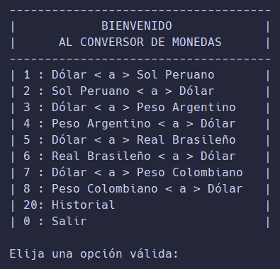
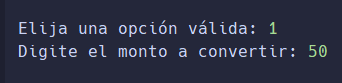
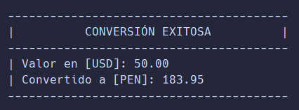
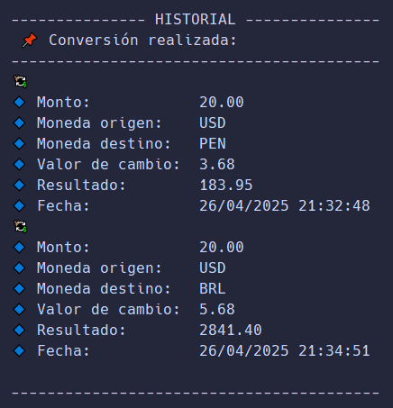

# 📦 Conversor de monedas - _'Convert Money'_

**Convert Money** es una aplicación desarrollada en Java que permite convertir valores entre
diferentes monedas, utilizando el tipo de cambio en tiempo real proporcionado por la
API [ExchangerRate-API](https://app.exchangerate-api.com/dashboard).

---

## 🎯 Objetivos del proyecto

Desarrollar una aplicación que facilite a los usuarios obtener la conversión actualizada entre
monedas, de forma rápida, segura y eficiente.

---

## 🧩 Requisitos funcionales

- Permite la conversión de montos monetarios entre distintas divisas según el tipo de cambio actual.
- Mostrar el resultado de la conversión al usuario de forma clara e inmediata.
- Almacenar un historial de las últimas conversiones realizadas por el usuario.

---

## 🛠 Tecnologías utilizadas

- **Java**: Lenguaje principal para el desarrollo de la lógica de la aplicación.
- **Gson**: Librería de Google utilizada para la serialización y de serialización de objetos JSON.
- **ExchangerRate-API**: Servicio externo que proporciona los tipos de cambios actualizados.
- **Postman**: Herramienta utilizada para pruebas de consumo del API REST.

---

## 🧱 Estructura del proyecto

El proyecto sigue una estructura básica de carpetas.

```
convert-money/
├── src/
│   ├── controller/  # Clase para iniciar la applicación
│   ├── dto/         # Clases para transferencia de datos
│   ├── model/       # Clases de dominio del negocio
│   └── Main.java    # Punto de entrada de la aplicación
├── resources/       # Recursos
│   └── static/
│       ├── history/ # Archivo que guarda los cambios de divisas.
│       └── images/  # Imagenes de la aplicación
├── README.md
├── .env.demo        # Ejemplo de archivo de variables de entorno
└── .gitignore
```

---

## 📄 Requisitos

- **Java Development Kit (JDK)** version 8 o superior (se recomienda utilizar JDK 17).
- **IDE recomendado**: IntelliJ IDEA (puedes usar cualquier otro de tu preferencia).

---

## Instalación y Configuración

1. Clonar repositorio
   ```bash
   git clone  https://github.com/puriihuaman/convert-money.git
   ```
   ```bash
   cd convert-money
   ```
2. Configurar variables de entorno
   Crear un archivo `.env` en la raíz del proyecto y agregar las variables necesarias siguiendo
   el formato del archivo `.env.demo`.
   ```
   SECRET_KEY=123237aada81baaxx... 
   ```
3. Ejecutar la aplicación
    - Abre el proyecto en tu IDE.
    - Haz clic derecho en la clase `main`.
    - Selecciona `Run Main.main()` para iniciar.

---

## 👨 Manual de usuario

Una vez que hayas instalado el proyecto y haber configurado las variables de entorno necesario
para el correcto funcionamiento, puedes ejecutar la aplicación.

La aplicación mostrara un menu al usuario con las siguientes opciones:

1. **Menu de conversión**

   
2. **Proceso de conversión**
    - El usuario debe ingresar la opción a realizar.
    - El usuario debe ingresar el monto a convertir.
    - Podrá realizar multiples operaciones dentro del menú.

   
3. **Ejemplo de conversión**

   
4. **Ejemplo de historial**

   
5. **Salida**  
   Al elegir la opción 0, el usuario saldrá del sistema y se mostrará un mensaje de despedida.

   
6. **Ejemplo del historial de cambios en formato JSON**
   ```json
   [
        {
            "money": {
                "base_code": "USD",
                "target_code": "PEN",
                "conversion_rate": 3.679,
                "conversion_result": 183.95,
                "amount": 50.0
            },
            "timestamp": "2025-04-26T21:32:48.409664100"
        },
        {
            "money": {
                "base_code": "USD",
                "target_code": "BRL",
                "conversion_rate": 5.6828,
                "conversion_result": 2841.4,
                "amount": 500.0
            },
            "timestamp": "2025-04-26T21:34:51.507417400"
        }
   ]
   ```

---

## 📨 Contacto

_Desarrollador_: **Pedro Purihuaman**

- GitHub: https://github.com/puriihuaman
- LinkedIn: https://www.linkedin.com/in/pedropurihuaman/
- Código fuente: https://github.com/puriihuaman/fast-order